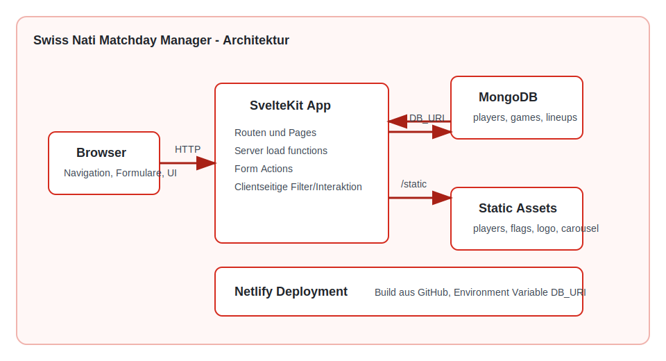
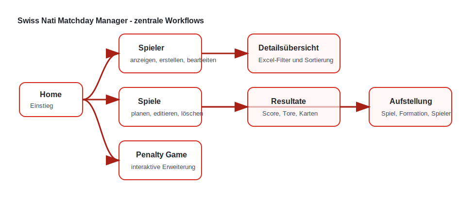

# Projektdokumentation - Swiss Nati Matchday Manager

## Inhaltsverzeichnis

1. [Ausgangslage](#1-ausgangslage)
2. [Lösungsidee](#2-lösungsidee)
3. [Vorgehen & Artefakte](#3-vorgehen--artefakte)
    1. [Understand & Define](#31-understand--define)
    2. [Sketch](#32-sketch)
    3. [Decide](#33-decide)
    4. [Prototype](#34-prototype)
    5. [Validate](#35-validate)
4. [Erweiterungen [Optional]](#4-erweiterungen-optional)
5. [Projektorganisation [Optional]](#5-projektorganisation-optional)
6. [KI-Deklaration](#6-ki-deklaration)
7. [Anhang [Optional]](#7-anhang-optional)

> **Hinweis:** Massgeblich sind die im **Unterricht** und auf **Moodle** kommunizierten Anforderungen.

<!-- WICHTIG: DIE KAPITELSTRUKTUR DARF NICHT VERÄNDERT WERDEN! -->

<!-- Diese Vorlage ist für eine README.md im Repository gedacht. Abschnitte mit [Optional] können weggelassen werden, wenn in den Übungen nichts anderes verlangt wird. -->

## 1. Ausgangslage

Im Rahmen des Prototyping-Projekts wurde eine Webanwendung entwickelt, mit der Informationen zur Schweizer Fussball-Nationalmannschaft verwaltet und in einem Matchday-Kontext genutzt werden können. Die Anwendung ist kein statisches Mockup, sondern ein funktionsfähiger Prototyp mit Datenbankanbindung, Formularen, Detailansichten, Filterfunktionen, Resultatdarstellung und interaktiven Erweiterungen.

- **Problem:** Für die Planung von Spielen, Kadern und Aufstellungen braucht es eine einfache Übersicht über Spieler, Positionen, Vereine, Status, Gegner und Termine. Ohne digitale Lösung müssen diese Informationen verteilt gesammelt und manuell gepflegt werden. Zusätzlich fehlt in einfachen Listen oft der Bezug zum eigentlichen Fussballkontext, zum Beispiel zu Aufstellungen, vergangenen Resultaten oder der Frage, welche Spieler für bestimmte Positionen verfügbar sind.

- **Ziele:**
  - Spieler erfassen, anzeigen, bearbeiten und löschen
  - Spieler-Detailseiten und eine vollständige Detailsübersicht bereitstellen
  - Spiele erfassen, anzeigen, bearbeiten und löschen
  - vergangene Spiele erkennbar darstellen und vor nachträglicher Bearbeitung schützen
  - Daten dauerhaft in MongoDB speichern
  - Spieler, Spiele und Aufstellungen miteinander verknüpfen
  - eine visuelle Matchday-Aufstellung pro Spiel speichern
  - Resultate vergangener Spiele übersichtlich darstellen
  - eine online zugängliche Version über Netlify bereitstellen
  - einen präsentierbaren, thematisch stimmigen Prototyp mit Branding und visuellen Assets erstellen

- **Primäre Zielgruppe:** Fussballinteressierte Personen, die eine einfache Verwaltung für Spieler, Spiele und Matchday-Aufstellungen der Schweizer Nationalmannschaft nutzen möchten. Im Projektkontext ist die Zielgruppe bewusst breit gehalten: Fans, organisatorisch interessierte Personen, Trainer:innen im Amateurkontext oder Personen, die einen Spieltag planen und visualisieren möchten.

- **Weitere Stakeholder [Optional]:** Dozierende im Modul Prototyping, Testpersonen der Evaluation, mögliche spätere Nutzende einer weiterentwickelten Version.

## 2. Lösungsidee

Der **Swiss Nati Matchday Manager** ist eine Web-App zur Verwaltung von Spielern, Spielen, Resultaten und Aufstellungen der Schweizer Nationalmannschaft. Die App verbindet klassische Datenpflege mit visuellen und interaktiven Elementen: Spielerbilder, Flaggen, SFV-Branding, Resultatkarten, Excel-ähnliche Tabellenfilter, ein Fussballfeld für Aufstellungen und ein kleines Penalty Game.

- **Kernfunktionalität:**
  - Spielerübersicht mit Bild, Name, Position und Detailzugriff
  - Spieler erstellen, bearbeiten und löschen
  - Spieler-Detailseite mit allen gespeicherten Daten
  - Detailsübersicht aller Spieler mit Sortierung und Mehrfachfilter
  - Spieleübersicht mit Gegnerflaggen und Status vergangener Spiele
  - Spiele erstellen, bearbeiten und löschen
  - Resultatansicht für vergangene Spiele mit Toren, Karten, Flaggen und Scoreline
  - Matchday-Aufstellung pro Spiel mit auswählbarer Formation
  - positionsbasierte Spielerauswahl mit Schutz vor doppelter Auswahl
  - Speicherung von Spielern, Spielen und Aufstellungen in MongoDB
  - Startseite mit Carousel, Branding und direkten Workflows
  - Penalty Game als zusätzliche interaktive Erweiterung

- **Annahmen [Optional]:**
  - Nutzende möchten zuerst schnell sehen, welche Spieler und Spiele vorhanden sind.
  - Für häufige Fragen wie "Welche Spieler sind fit?" oder "Welche Spieler sind Rechtsfüsser?" ist eine filterbare Detailsübersicht hilfreich.
  - Eine Aufstellung auf einem Fussballfeld ist intuitiver als eine reine Positionsliste.
  - Resultate und Flaggen erhöhen den Wiedererkennungswert und machen die App stärker thematisch.
  - Eine einfache, robuste App ist für den Prototyp wertvoller als eine komplexe Lösung mit Login und Rollen.

- **Abgrenzung [Optional]:**
  - Es gibt keine Login-Funktion und keine Rollenverwaltung.
  - Resultate werden nicht live aus einer externen API geladen, sondern im Projektkontext gepflegt bzw. aus lokalen bekannten Resultatdaten angereichert.
  - Spielerbilder und Logos dienen als Prototyp-Assets.
  - Der Prototyp ist nicht als produktives System für echte Verbandsdaten gedacht.
  - **TODO vor Abgabe prüfen:** Nutzungsrechte aller Spielerbilder, Flaggen und Logos final dokumentieren oder durch eindeutig lizenzfreie/eigene Assets ersetzen.

## 3. Vorgehen & Artefakte

Die Durchführung erfolgte phasenbasiert. Zuerst wurde der Problemraum eingegrenzt, danach wurden Varianten und Workflows entschieden, anschliessend ein funktionsfähiger SvelteKit-Prototyp umgesetzt und iterativ verbessert.

### 3.1 Understand & Define

- **Zielgruppenverständnis:**  
  Die Zielgruppe braucht eine einfache Möglichkeit, Spieler- und Spieldaten zu verwalten und diese Daten in konkrete Matchday-Situationen zu übertragen. Besonders wichtig sind schnelle Orientierung, klare Navigation und ein sichtbarer Mehrwert gegenüber einer einfachen Tabelle. Die App soll daher nicht nur Daten speichern, sondern diese auch in Fussballlogik übersetzen: Aufstellungen, Resultate, Spielerstatus und Gegner.

  **Proto-Persona:**

  | Merkmal | Beschreibung |
  | --- | --- |
  | Name | Luca, 24, Fussballfan und organisatorisch interessierte Person |
  | Ziel | Spielerstatus, Spiele, Resultate und mögliche Aufstellungen schnell überblicken |
  | Bedürfnisse | einfache Navigation, klare Spielerdaten, schnelle Filter, visuelle Aufstellung |
  | Frustpunkte | Informationen sind oft verteilt; Aufstellungen müssen manuell nachgeführt werden |
  | Erfolgskriterium | Luca kann ein Spiel planen, passende Spieler auswählen und die Aufstellung später wiederfinden |

- **Wesentliche Erkenntnisse:**
  - Ein klarer Datenworkflow ist zentral: erfassen, speichern, anzeigen, bearbeiten.
  - Die App muss trotz vieler Funktionen einfach navigierbar bleiben.
  - Eine reine Tabelle wäre für den Fussballkontext zu trocken; visuelle Elemente erhöhen Verständlichkeit.
  - Filter und Sortierung werden wichtiger, sobald mehr Spielerdaten gepflegt werden.
  - Vergangene Spiele brauchen eine andere Logik als zukünftige Spiele.
  - Erweiterungen sollen den fachlichen Kontext stärken und nicht nur dekorativ sein.

### 3.2 Sketch

- **Variantenüberblick:**

  | Variante | Nutzen | Einschränkung | Entscheid |
  | --- | --- | --- | --- |
  | reine Spielerübersicht | schnell umsetzbar, klare Datenpflege | wenig thematischer Mehrwert | verworfen |
  | reine Spielplanung | Spiele können strukturiert verwaltet werden | Spielerbezug fehlt | verworfen |
  | Kader- und Matchday-Manager | verbindet Spieler, Spiele und Aufstellung | höherer Umsetzungsaufwand | gewählt |
  | Resultat- und Statistikseite | stärkt Fussballkontext | Zusatzaufwand | als Erweiterung umgesetzt |
  | Penalty Game | interaktiv und präsentierbar | nicht Kernworkflow | als Erweiterung umgesetzt |

  **Priorisierte Anforderungen:**

  | Priorität | Anforderung | Begründung |
  | --- | --- | --- |
  | Must | Spieler und Spiele erfassen, anzeigen und speichern | Mindestumfang und zentraler Workflow |
  | Must | Datenbankanbindung mit MongoDB | macht den Prototyp dauerhaft nutzbar |
  | Must | Online-Version bereitstellen | Voraussetzung für Abgabe und Test |
  | Should | Spieler und Spiele bearbeiten/löschen | realistische Datenpflege |
  | Should | Aufstellung pro Spiel speichern | fachlicher Mehrwert |
  | Should | Detailsübersicht mit Filter/Suche | bessere Nutzbarkeit bei vielen Daten |
  | Could | Resultate und Karten anzeigen | Kontext und Präsentation |
  | Could | Penalty Game | spielerische Erweiterung |

- **Skizzen:**
  Die wichtigsten Screens wurden konzeptionell als Seitenstruktur und Workflow skizziert:
  - Home mit Einstieg in die wichtigsten Workflows
  - Spielerübersicht als Kartenansicht
  - Spieler-Detailseite und Detailsübersicht als Tabelle
  - Spieleübersicht als Match-Karten
  - Resultate als dunkle Scorecards
  - Matchday-Aufstellung als Fussballfeld
  - Penalty Game als interaktive Spielszene

  **Architekturdiagramm als Draw.io-kompatible SVG-Datei:**

  

  **TODO optional:** Falls gewünscht, die Diagramme in VS Code mit der Draw.io Extension weiter verfeinern. Die Dateien haben bereits die geforderte Endung `.drawio.svg`.

### 3.3 Decide

- **Gewählte Variante & Begründung:**  
  Gewählt wurde der **Swiss Nati Matchday Manager**, weil diese Variante den Mindestumfang erfüllt und gleichzeitig mehrere sinnvolle Erweiterungen ermöglicht. Die App zeigt einen vollständigen End-to-End-Prozess: Daten erfassen, speichern, anzeigen, filtern, bearbeiten und in einem fachlichen Kontext verwenden.

  **Entscheidungsmatrix:**

  | Entscheidung | Gewählte Lösung | Begründung |
  | --- | --- | --- |
  | Frontend-Framework | SvelteKit | Routing, Server-Load-Funktionen und Form Actions passen gut zum Projekt |
  | Datenbank | MongoDB Atlas | flexible Dokumentstruktur für Spieler, Spiele und Lineups |
  | UI-Basis | Bootstrap plus eigenes CSS | schnelle Basis, gezielte individuelle Gestaltung |
  | Spieleransicht | Karten plus Detailseite | übersichtlich, aber erweiterbar |
  | Detailsübersicht | Tabelle mit Excel-ähnlichen Filtern | effizient bei vielen Spielerdaten |
  | Aufstellung | eigenes Fussballfeld-Layout | fachlich passend und visuell verständlich |
  | Resultate | eigene Scorecards | stärkt den Fussballkontext |
  | Deployment | Netlify | einfacher automatischer Deployment-Workflow |

- **End-to-End-Ablauf:**
  1. Nutzer:in öffnet die Startseite.
  2. Nutzer:in navigiert zu Spieler oder Spiele.
  3. Nutzer:in erstellt oder bearbeitet Datensätze.
  4. Die Daten werden in MongoDB gespeichert.
  5. Die Daten erscheinen in Übersicht, Details und Filtertabelle.
  6. Nutzer:in öffnet die Aufstellungsseite.
  7. Nutzer:in wählt Spiel und Formation.
  8. Nutzer:in weist verfügbare Spieler den Positionen zu.
  9. Die Aufstellung wird gespeichert und kann später wieder geladen werden.
  10. Vergangene Spiele können in der Resultatansicht betrachtet werden.

  ```mermaid
  flowchart LR
      A[Home] --> B[Spieler]
      A --> C[Spiele]
      A --> D[Game]
      B --> E[Detailsübersicht]
      C --> F[Resultate]
      C --> G[Aufstellung]
      G --> H[Formation wählen]
      H --> I[Spieler positionsbasiert zuweisen]
      I --> J[Lineup speichern]
  ```

  **User-Flow-Diagramm als Draw.io-kompatible SVG-Datei:**

  

- **Mockup:**  
  Der Prototyp wurde direkt als klickbare High-Fidelity-Version in SvelteKit umgesetzt. Zusätzlich wurden die zentralen Seiten und Workflows in der Dokumentation beschrieben und als Diagramme ergänzt.  
  **TODO falls von der Lehrperson zwingend verlangt:** Figma- oder Draw.io-Mockup-Link ergänzen. Aktuell ist kein separates Figma-Mockup dokumentiert.

### 3.4 Prototype

#### 3.4.1. Entwurf (Design)

Beschreibt die Gestaltung und Interaktion.

> **Hinweis:** Hier wird der **Prototyp** beschrieben, nicht das **Mockup**.

- **Informationsarchitektur:**  
  Die App besteht aus folgenden Hauptbereichen:
  - Home
  - Spieler
  - Spieler erstellen
  - Spieler bearbeiten
  - Spieler-Details
  - Spieler-Detailsübersicht
  - Spiele
  - Spiel erstellen
  - Spiel bearbeiten
  - Resultate
  - Aufstellung
  - Penalty Game

- **User Interface Design:**  
  Die App nutzt eine rote Swiss-Nati-Farbwelt, SFV-Logo-Elemente, lokale Flaggen und Spielerbilder. Die Startseite dient als Einstieg in die wichtigsten Workflows. Spieler werden auf Karten angezeigt, während vollständige Daten in der Detailsübersicht tabellarisch dargestellt werden. Spiele erscheinen als Match-Karten mit Flaggen, Resultate als dunkle Scorecards mit Toren und Karten. Die Aufstellung verwendet ein Fussballfeld, damit Positionen räumlich erkennbar werden. Das Penalty Game ist bewusst spielerischer gestaltet und nutzt CSS-Animationen.

  **TODO vor Abgabe:** Falls die Bewertung Screenshots direkt in der README erwartet, 3-5 aktuelle Screenshots ergänzen: Startseite, Spielerübersicht, Detailsübersicht mit Filter, Aufstellung und Resultate.

- **Designentscheidungen:**
  - Karten für schnelle Übersicht, Tabellen für detaillierte Datenarbeit.
  - Eigenes CSS für Spezialansichten wie Aufstellung, Resultate und Game.
  - Einheitliche Logos in Seitenköpfen, damit die App stärker gebrandet wirkt.
  - Excel-ähnliche Filter in der Detailsübersicht, weil dieses Muster bekannt und effizient ist.
  - Vergangene Spiele werden anders behandelt als zukünftige Spiele.
  - Resultate verwenden feste Spalten, damit Tore und Karten einheitlich ausgerichtet sind.
  - Die Startseite verwendet grosse, direkte Call-to-Action-Links ohne unnötige Erklärtexte.

#### 3.4.2. Umsetzung (Technik)

Fasst die technische Realisierung zusammen.

- **Technologie-Stack:**
  - SvelteKit
  - Svelte 5
  - JavaScript
  - HTML / CSS
  - Bootstrap
  - MongoDB Atlas
  - Netlify
  - Git / GitHub

- **Tooling:**
  - Visual Studio Code
  - GitHub Repository
  - Netlify Deployment
  - MongoDB Atlas / MongoDB Compass
  - Draw.io Extension für `.drawio.svg`-Diagramme
  - Mermaid für einfache Diagramme direkt im Markdown
  - ChatGPT/Codex als Pair-Programming- und Dokumentationshilfe

- **Struktur & Komponenten:**
  - `src/routes/+layout.svelte`: globales Layout, Navigation, Branding
  - `src/routes/+page.svelte`: Startseite mit Hero, Carousel und Workflows
  - `src/routes/players/+page.svelte`: Spielerübersicht
  - `src/routes/players/create/+page.svelte`: Spieler erfassen
  - `src/routes/players/[id]/details/+page.svelte`: Spieler-Detailseite
  - `src/routes/players/[id]/edit/+page.svelte`: Spieler bearbeiten
  - `src/routes/players/overview/+page.svelte`: Detailsübersicht mit Filtern
  - `src/routes/games/+page.svelte`: Spieleübersicht
  - `src/routes/games/create/+page.svelte`: Spiel erfassen
  - `src/routes/games/[id]/edit/+page.svelte`: Spiel bearbeiten
  - `src/routes/games/results/+page.svelte`: Resultatansicht
  - `src/routes/lineup/+page.svelte`: Matchday-Aufstellung
  - `src/routes/lineup/lineup.css`: eigenes Fussballfeld-Stylesheet
  - `src/routes/game/+page.svelte`: Penalty Game
  - `src/lib/server/db.js`: Datenbankfunktionen
  - `src/lib/country-flags.js`: Länder, Flaggen, Anzeigeformatierung
  - `src/lib/match-results.js`: bekannte Resultate und Ereignisse
  - `static/players`, `static/flags`, `static/logo`, `static/carousel`: statische Assets
  - `docs/*.drawio.svg`: Diagramme für Dokumentation

- **Daten & Schnittstellen:**  
  Die Daten werden in MongoDB Atlas gespeichert. Es gibt drei zentrale Collections:

  | Collection | Zweck | Beispiele für Daten |
  | --- | --- | --- |
  | `players` | Verwaltung der Spielerdaten | Name, Position, Club, Status, Marktwert |
  | `games` | Verwaltung der Spiele | Gegner, Datum, Ort, Wettbewerb, Resultat |
  | `lineups` | Speicherung der Aufstellungen pro Spiel | Spiel-ID, Formation, gewählte Spieler pro Position |

  Daten werden über SvelteKit `load`-Funktionen geladen. Neue oder geänderte Datensätze werden über Form Actions verarbeitet. Die Aufstellung wird über eine eigene Lineup-Collection gespeichert. Beim Löschen von Spielen werden zugehörige Lineups entfernt. Beim Ändern von Spielerpositionen werden gespeicherte Aufstellungen synchronisiert, damit Spieler nicht auf unpassenden Positionen stehen bleiben.

  **Technische Architektur als Mermaid-Diagramm:**

  ```mermaid
  flowchart TD
      U[Nutzer:in] --> R[SvelteKit Routing]
      R --> P[Pages und Form Actions]
      P --> L[src/lib/server/db.js]
      L --> M[(MongoDB Atlas)]
      P --> A[Statische Assets]
      A --> F[Flaggen, Logos, Spielerbilder]
      P --> N[Netlify Deployment]
  ```

  **Architektur zusätzlich als Draw.io-kompatible SVG-Datei:**

  

- **Deployment:**  
  Online-Version: https://swiss-nati-matchday-manager.netlify.app  
  GitHub Repository: https://github.com/kenkasha/Swiss-Nati

- **Besondere Entscheidungen:**
  - `DB_URI` wird nicht im Repository gespeichert, sondern lokal und in Netlify als Environment Variable verwendet.
  - Die App verwendet keine externe Fussballdaten-API, damit der Prototyp kontrollierbar bleibt.
  - Spielerbilder werden über Dateinamen aus Nachnamen abgeleitet und bei fehlenden Bildern durch ein Dummy-Bild ersetzt.
  - Länderdaten werden normalisiert, damit z. B. `USA` korrekt angezeigt und Flaggen zuverlässig geladen werden.
  - Detailsübersicht und Resultate verwenden clientseitige Darstellung/Filter, weil die Datenmenge im Prototyp klein bleibt.

### 3.5 Validate

- **URL der getesteten Version:**  
  https://swiss-nati-matchday-manager.netlify.app

- **Ziele der Prüfung:**
  - Verstehen Testpersonen die Navigation?
  - Können Testpersonen Spieler und Spiele erfassen?
  - Finden Testpersonen Details, Detailsübersicht, Resultate und Aufstellung?
  - Ist der Unterschied zwischen zukünftigen und vergangenen Spielen verständlich?
  - Ist die Aufstellung als Workflow verständlich?
  - Sind Filter in der Detailsübersicht nützlich und bedienbar?
  - Wirkt die App visuell wie ein zusammenhängender Prototyp?

- **Vorgehen:**  
  Es wurde ein kurzer moderierter Usability-Test mit zwei Studierenden durchgeführt. Die Testpersonen erhielten typische Aufgaben und sollten während der Nutzung laut denken. Nach einzelnen Aufgaben wurden kurze Rückfragen gestellt. Die Beobachtungen wurden direkt notiert und in der anschliessenden Iteration für Verbesserungen genutzt.

- **Stichprobe:**  
  Zwei Studierende aus dem Umfeld des Moduls Prototyping. Beide kennen Webanwendungen, aber waren nicht an der Umsetzung beteiligt.

  **TODO ergänzen:** Namen anonymisieren oder Profile präzisieren, z. B. "Testperson A: Studentin, sportinteressiert" / "Testperson B: Student, technisch affin".

- **Aufgaben/Szenarien:**
  1. Startseite öffnen und erklären, welche Funktionen erwartet werden.
  2. Spielerübersicht öffnen und einen Spieler im Detail ansehen.
  3. Einen neuen Spieler erfassen und prüfen, ob er erscheint.
  4. Detailsübersicht öffnen und nach Position oder Status filtern.
  5. Ein neues Spiel erfassen.
  6. Spieleübersicht prüfen und ein vergangenes Spiel erkennen.
  7. Resultate öffnen und Tor-/Karteninformationen interpretieren.
  8. Aufstellungsseite öffnen, Spiel wählen, Formation ändern und mehrere Spieler platzieren.
  9. Prüfen, ob ein Spieler doppelt ausgewählt werden kann.
  10. Penalty Game öffnen und einen Schuss ausführen.

- **Kennzahlen & Beobachtungen:**

  | Testaufgabe | Erfolgskriterium | Beobachtung | Schweregrad | Verbesserung |
  | --- | --- | --- | --- | --- |
  | Navigation verstehen | zentrale Bereiche werden gefunden | Navigation war grundsätzlich verständlich | 0 | keine |
  | Spieler erfassen | Spieler erscheint danach | Formular war verständlich | 0 | keine |
  | Detailsübersicht nutzen | Filter werden verstanden | ursprünglicher Einzelauswahl-Filter war zu eingeschränkt | 2 | Excel-ähnliche Checkbox-Filter umgesetzt |
  | Geburtsdatum filtern | sinnvoll nach Alter/Jahr filtern | komplettes Datum als Filter war wenig hilfreich | 2 | Filter auf Geburtsjahr geändert |
  | Aufstellung erstellen | Spiel, Formation, Spieler wählbar | Workflow wurde verstanden, doppelte Auswahl verhindert | 1 | Spielerbilder und Layout verfeinert |
  | Resultate lesen | Tore/Karten klar erkennbar | Ausrichtung war zwischen Spielen uneinheitlich | 1 | feste Spalten und Mindesthöhen umgesetzt |
  | Branding wahrnehmen | App wirkt thematisch passend | SFV-Logo und Flaggen wurden positiv wahrgenommen | 0 | Logo-Positionen optimiert |

- **Zusammenfassung der Resultate:**  
  Die Grundworkflows wurden verstanden und konnten abgeschlossen werden. Die wichtigsten Probleme lagen nicht in der Datenpflege, sondern in Details der Bedienung und Darstellung: Filter sollten mehrere Kriterien unterstützen, Geburtsdaten sollten nach Jahr filterbar sein, und Resultate sollten einheitlicher ausgerichtet werden. Diese Punkte wurden im Prototyp umgesetzt.

- **Abgeleitete Verbesserungen:**
  - Excel-ähnliche Mehrfachfilter in der Detailsübersicht umgesetzt.
  - Geburtsdatum-Filter auf Geburtsjahr geändert.
  - SFV-Logo und Branding auf mehreren Seiten vereinheitlicht.
  - Resultate-Layout mit festen Spalten und einheitlicher Ausrichtung verbessert.
  - Ländernamen und Flaggenlogik verbessert, z. B. `USA` statt `Usa`.
  - **TODO vor Abgabe:** Falls möglich, 1-2 Screenshots der Testdurchführung oder der verbesserten Screens im Anhang ergänzen.

## 4. Erweiterungen [Optional]

Dokumentiert Erweiterungen über den Mindestumfang hinaus.

> **Hinweis:** Jede Erweiterung ist separat nach dem folgenden Schema zu beschreiben.

### 4.1 Matchday-Aufstellung mit Fussballfeld

- **Beschreibung & Nutzen:**  
  Zusätzlich zur Spieler- und Spielverwaltung gibt es eine visuelle Aufstellungsseite. Nutzende wählen ein Spiel, eine Formation und die passenden Spieler pro Position. Die Darstellung auf einem Fussballfeld macht den Matchday-Kontext sichtbar und ist verständlicher als eine reine Tabelle.

- **Wo umgesetzt:**
  - **Frontend:** `src/routes/lineup/+page.svelte`
  - **Backend / Datenladen:** `src/routes/lineup/+page.server.js`
  - **Styling:** `src/routes/lineup/lineup.css`
  - **Datenbank:** `lineups` Collection
  - **Assets:** `static/players`

- **Referenz:**  
  Sichtbar unter `/lineup` bzw. Navigationspunkt `Aufstellung`.

- **Aus Evaluation abgeleitet?:**  
  Nein, als fachliche Erweiterung geplant. Kleinere Layout- und Bildanpassungen entstanden aus iterativer Nutzung.

### 4.2 Eigenes Stylesheet für die Aufstellungsansicht

- **Beschreibung & Nutzen:**  
  Das Fussballfeld, Linien, Positionskarten und Spielerbilder sind in einem eigenen CSS-File gebündelt. Dadurch bleibt die Aufstellung technisch und gestalterisch getrennt vom Standardlayout.

- **Wo umgesetzt:**
  - **Styling:** `src/routes/lineup/lineup.css`
  - **Import:** `src/routes/lineup/+page.svelte`

- **Referenz:**  
  Sichtbar auf der Aufstellungsseite.

- **Aus Evaluation abgeleitet?:**  
  Nein. Die Erweiterung unterstützt Wartbarkeit und Übersichtlichkeit.

### 4.3 Spieler-Details, Bearbeitung und Detailsübersicht

- **Beschreibung & Nutzen:**  
  Die Spielerübersicht bleibt bewusst kompakt. Detailinformationen sind über eigene Detailseiten und eine vollständige Detailsübersicht verfügbar. Dadurch sind Schnellansicht und Datenanalyse getrennt.

- **Wo umgesetzt:**
  - `src/routes/players/+page.svelte`
  - `src/routes/players/[id]/details/+page.svelte`
  - `src/routes/players/[id]/edit/+page.svelte`
  - `src/routes/players/overview/+page.svelte`
  - `src/lib/server/db.js`

- **Referenz:**  
  Navigationspunkt `Spieler`, Unterpunkt `Detailsübersicht`.

- **Aus Evaluation abgeleitet?:**  
  Teilweise. Die Trennung entstand aus dem Bedarf, die Hauptübersicht nicht zu überladen.

### 4.4 Spielbearbeitung mit Schutz vergangener Spiele

- **Beschreibung & Nutzen:**  
  Zukünftige Spiele können bearbeitet werden. Vergangene Spiele werden anders behandelt, weil sie fachlich nicht mehr wie Planungsdaten geändert werden sollen. Beim Löschen von Spielen werden zugehörige Lineups entfernt.

- **Wo umgesetzt:**
  - `src/routes/games/+page.svelte`
  - `src/routes/games/[id]/edit/+page.svelte`
  - `src/routes/games/[id]/edit/+page.server.js`
  - `src/lib/server/db.js`

- **Referenz:**  
  Spieleübersicht und Bearbeitungsseite.

- **Aus Evaluation abgeleitet?:**  
  Nein, fachliche Plausibilitätsentscheidung.

### 4.5 Bootstrap-Carousel und klickbare Startseiten-Workflows

- **Beschreibung & Nutzen:**  
  Die Startseite nutzt ein Carousel und direkte Einstiegskarten. Dadurch wird die App präsentabler und Nutzende gelangen schneller zu Spieler, Spiele und Aufstellung.

- **Wo umgesetzt:**
  - `src/routes/+page.svelte`
  - `static/carousel`

- **Referenz:**  
  Startseite `/`.

- **Aus Evaluation abgeleitet?:**  
  Teilweise aus iterativer Verbesserung der Startseite und Präsentierbarkeit.

### 4.6 Filter- und Sortierfunktion in der Detailsübersicht

- **Beschreibung & Nutzen:**  
  Die Detailsübersicht enthält Excel-ähnliche Filtermenüs mit Checkboxen. Mehrere Kriterien können gleichzeitig gewählt werden. Zusätzlich kann sortiert werden. Beim Geburtsdatum wird nach Geburtsjahr gefiltert, weil das vollständige Datum als Filter wenig sinnvoll ist.

- **Wo umgesetzt:**
  - **Frontend:** `src/routes/players/overview/+page.svelte`
  - **Logik:** clientseitige Mehrfachfilter und Sortierung

- **Referenz:**  
  Spieler > Detailsübersicht.

- **Aus Evaluation abgeleitet?:**  
  Ja. Die Filter wurden nach Rückmeldung und eigener Prüfung mehrfach angepasst.

### 4.7 Penalty Game

- **Beschreibung & Nutzen:**  
  Das Penalty Game nutzt vorhandene Spielerdaten. Nutzende wählen einen Feldspieler als Schützen, der Goalie wird automatisch aus Spielern mit Position `Goalie` bestimmt. Der Zielpunkt folgt der Maus, der Ball fliegt sichtbar zum Ziel, und Tore/Paraden werden gezählt.

- **Wo umgesetzt:**
  - **Frontend:** `src/routes/game/+page.svelte`
  - **Datenladen:** `src/routes/game/+page.server.js`
  - **Datenbasis:** MongoDB `players`

- **Referenz:**  
  Navigationspunkt `Game`.

- **Aus Evaluation abgeleitet?:**  
  Nein. Es ist eine zusätzliche, thematisch passende Interaktion.

### 4.8 Resultate mit Toren, Karten und Flaggen

- **Beschreibung & Nutzen:**  
  Vergangene Spiele werden als Resultatkarten dargestellt. Die Karten zeigen Wettbewerb, Datum, Status, Heim-/Auswärtsteam, Flaggen, Score, Torschützen und Kartenereignisse. Das unterstützt die Nachvollziehbarkeit vergangener Spiele und verbindet Spieldaten mit Fussballereignissen.

- **Wo umgesetzt:**
  - **Frontend:** `src/routes/games/results/+page.svelte`
  - **Datenanreicherung:** `src/lib/match-results.js`
  - **Flaggen:** `src/lib/country-flags.js`, `static/flags`

- **Referenz:**  
  Spiele > Resultate.

- **Aus Evaluation abgeleitet?:**  
  Teilweise. Die einheitliche Ausrichtung von Toren und Karten wurde nach visueller Prüfung verbessert.

### 4.9 Branding, Logos und Länder-/Flaggenlogik

- **Beschreibung & Nutzen:**  
  Die App nutzt SFV-Logos, lokale Flaggen und eine normalisierte Länderanzeige. Dadurch wirkt der Prototyp stimmiger und Fehler wie `Usa` statt `USA` oder fehlende Flaggen werden vermieden.

- **Wo umgesetzt:**
  - `src/routes/+layout.svelte`
  - `src/routes/+page.svelte`
  - `src/lib/country-flags.js`
  - `static/logo`
  - `static/flags`

- **Referenz:**  
  Sichtbar auf Home, Spieler, Spiele, Resultate, Detailsübersicht und Aufstellung.

- **Aus Evaluation abgeleitet?:**  
  Teilweise aus iterativer visueller Verbesserung.

## 5. Projektorganisation [Optional]

- **Repository & Struktur:**  
  GitHub Repository: https://github.com/kenkasha/Swiss-Nati

  Die Projektstruktur folgt der SvelteKit-Logik:
  - `src/routes` für Seiten und Server-Load-Funktionen
  - `src/lib` für gemeinsame Logik
  - `src/lib/server` für Datenbankzugriffe
  - `static` für öffentlich verfügbare Assets
  - `docs` für Diagramme und Dokumentationsartefakte

- **Issue-Management:**  
  Für die Schlussphase wurden offene Aufgaben als To-do-Liste gepflegt. Grössere Themen waren Evaluation, README-Finalisierung, Video-Walkthrough, Bildrechte und Screenshots.

  | Aufgabe | Status |
  | --- | --- |
  | App-Funktionen final prüfen | erledigt |
  | README strukturkonform finalisieren | erledigt |
  | Diagramme ergänzen | erledigt |
  | Video-Walkthrough vorbereiten | TODO |
  | Bildquellen und Nutzungsrechte prüfen | TODO |
  | GitHub-Zip und Abgabe vorbereiten | TODO |

- **Commit-Praxis:**  
  Es wurden sprechende Commits für grössere Funktionsblöcke verwendet. Für die finale Abgabe sollte nach jedem abgeschlossenen Punkt nochmals committed werden.

  **TODO vor Abgabe:** Finalen Commit erstellen, Repository pushen und danach Netlify-Deployment prüfen.

## 6. KI-Deklaration

Die folgende Deklaration ist verpflichtend und beschreibt den Einsatz von KI im Projekt.

### 6.1 KI-Tools

- **Eingesetzte Tools:**  
  ChatGPT/Codex wurde als Unterstützung im Projekt eingesetzt. Zusätzlich wurden VS Code, SvelteKit-Dokumentation, Draw.io/Mermaid-Unterstützung und klassische Entwicklungswerkzeuge genutzt.

- **Zweck & Umfang:**  
  KI wurde verwendet für:
  - technische Erklärung von SvelteKit, Routing, Form Actions und MongoDB-Anbindung
  - Vorschläge für Code-Struktur und Fehlerbehebung
  - Unterstützung bei UI-Anpassungen und CSS
  - iterative Umsetzung von Erweiterungen wie Aufstellung, Resultate, Filter und Game
  - Formulierung und Konsolidierung der Projektdokumentation
  - Prüfung, ob README-Inhalte zur Vorlage passen

- **Eigene Leistung (Abgrenzung):**  
  Die Projektidee, fachlichen Entscheidungen, Auswahl der finalen Funktionen, Tests, Abgabe und Verantwortung liegen bei mir. KI-Vorschläge wurden geprüft, angepasst und im Projektkontext getestet. Der Code wurde nicht ungeprüft übernommen.

### 6.2 Prompt-Vorgehen

Beim Einsatz von KI wurde schrittweise gearbeitet. Zuerst wurde jeweils das gewünschte Verhalten beschrieben, oft mit Screenshot. Danach wurden relevante Dateien gelesen, eine kleine Änderung umgesetzt und anschliessend im Browser oder über `npm run build` geprüft. Bei visuellen Problemen wurde iterativ nachjustiert.

Typische Vorgehensweise:

| Schritt | Vorgehen | Qualitätssicherung |
| --- | --- | --- |
| 1. Problem beschreiben | Screenshot oder konkrete Beschreibung | Zielverhalten formuliert |
| 2. Codekontext prüfen | relevante Svelte-, CSS- oder Serverdateien lesen | bestehende Struktur beachten |
| 3. Kleine Änderung umsetzen | gezielte Anpassung statt grosser Refactor | Seiteneffekte vermeiden |
| 4. Testen | Browserprüfung und/oder `npm run build` | Fehler sofort korrigieren |
| 5. Dokumentieren | README und Erweiterungen aktualisieren | Struktur der Vorlage beibehalten |

Die KI wurde besonders für iteratives Pair Programming genutzt. Ein Beispiel ist die Detailsübersicht: Ausgehend von einfachen Select-Filtern wurden Geburtsjahrfilter, Checkbox-Menüs und Outside-Click-Verhalten Schritt für Schritt verbessert.

### 6.3 Reflexion

Der KI-Einsatz war hilfreich, weil komplexe Aufgaben in kleinere Schritte zerlegt wurden. Besonders bei SvelteKit-Details, CSS-Layout und README-Formulierungen beschleunigte dies die Arbeit. Gleichzeitig zeigte sich, dass KI-Vorschläge nicht automatisch korrekt sind. Einige UI-Interaktionen mussten mehrfach präzisiert werden, bis das Verhalten den Erwartungen entsprach.

Wichtig war deshalb:
  - jeden Codevorschlag selbst zu testen
  - Screenshots und konkrete Zielzustände zu verwenden
  - Änderungen klein zu halten
  - fachliche Entscheidungen selbst zu treffen
  - Urheberrecht und Quellen eigenständig zu prüfen

**TODO vor Abgabe:** KI-Deklaration nochmals mit den tatsächlich verwendeten Tools/Versionen abgleichen, falls zusätzlich Copilot, Claude oder andere Tools verwendet wurden.

## 7. Anhang [Optional]

- **Online-Version:** https://swiss-nati-matchday-manager.netlify.app
- **GitHub Repository:** https://github.com/kenkasha/Swiss-Nati
- **Architekturdiagramm:** `docs/architecture.drawio.svg`
- **User-Flow-Diagramm:** `docs/user-flow.drawio.svg`
- **Verwendete Technologien:** SvelteKit, Svelte 5, Bootstrap, MongoDB Atlas, Netlify, GitHub
- **Build-Test:** `npm run build` wurde während der Schlussphase wiederholt erfolgreich ausgeführt.

**Quellen / Assets:**

- Spielerbilder: `static/players`
- Flaggen: `static/flags`
- Logos: `static/logo`
- Carousel-Bilder: `static/carousel`
- Draw.io/Mermaid-Diagramme: `docs`

**TODO vor finaler Abgabe:**

- [ ] Bildquellen und Nutzungsrechte final prüfen und hier konkret dokumentieren.
- [ ] Falls nötig Spielerbilder durch eigene oder eindeutig lizenzfreie Platzhalter ersetzen.
- [ ] Video-Walkthrough aufnehmen und bei Moodle hochladen.
- [ ] README nochmals in der GitHub-Vorschau prüfen, besonders Mermaid und `.drawio.svg`-Diagramme.
- [ ] GitHub Repository als ZIP herunterladen.
- [ ] URL des GitHub-Repositories in Moodle eintragen.
- [ ] URL der deployten Netlify-App in Moodle eintragen.
- [ ] Falls Repo privat ist: Dozierende als Mitarbeitende hinzufügen oder Repo öffentlich machen.
- [ ] Finalen Push durchführen und Netlify-Deployment nochmals testen.

**Fortlaufendes Änderungsprotokoll:**

- Spielerübersicht vereinfacht und mit Detailzugriff ergänzt
- Spieler-Detailseiten und Detailsübersicht ergänzt
- Spielerbearbeitung inklusive Marktwert und Status umgesetzt
- Spiele erstellen, bearbeiten und löschen umgesetzt
- Vergangene Spiele geschützt und visuell unterschieden
- Matchday-Aufstellung mit Fussballfeld, Formationen und gespeicherten Lineups ergänzt
- Doppelte Spielerauswahl in Aufstellungen verhindert
- Spielerbilder und Fallback-Bild integriert
- Bootstrap-Carousel und klickbare Startseiten-Workflows ergänzt
- Resultate mit Score, Toren, Karten, Flaggen und einheitlichem Layout umgesetzt
- Excel-ähnliche Mehrfachfilter in der Detailsübersicht umgesetzt
- Geburtsdatum-Filter auf Geburtsjahr geändert
- Länder- und Flaggenlogik verbessert, inklusive `USA`
- SFV-Branding und Logos auf zentralen Seiten ergänzt
- Penalty Game mit Schützenwahl, Goalie, Ballflug und Score-Anzeige umgesetzt
